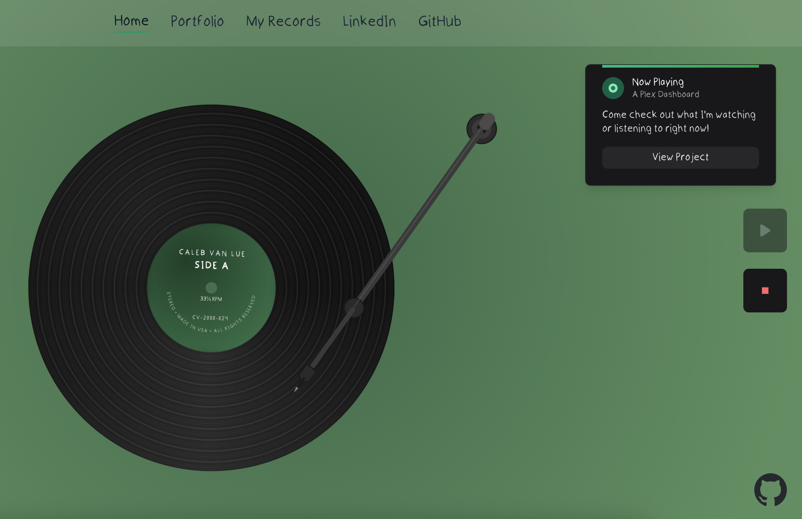

# Side A

An interactive portfolio website with a vinyl record player interface. Place the needle on the record to see it spin and reveal another of my projects.



## Overview

This portfolio site combines the nostalgic feel of vinyl records with modern web technologies. The centerpiece is an interactive record player where visitors can drag the tone arm onto a vinyl record, watch it spin, and discover my projects (more on the way!).

## Features

- **Interactive Vinyl Record**: A realistic vinyl record that spins when the needle is placed on it
- **Draggable Tone Arm**: Drag and drop the tone arm onto the record
- **Ambient Background**: Dynamic gradient background that animates when the record plays
- **Responsive Design**: Fully responsive layout that works on desktop and mobile devices
- **Project Showcase**: Card that appears when the record is playing to showcase projects
- **Elegant Side Navigation**: Accessible side drawer menu with social links

## Technologies

- [Next.js](https://nextjs.org/) - React framework
- [TypeScript](https://www.typescriptlang.org/) - Type safety
- [Tailwind CSS](https://tailwindcss.com/) - Styling
- [Framer Motion](https://www.framer.com/motion/) - Animations
- [Granim.js](https://sarcadass.github.io/granim.js/) - Gradient animations

## Getting Started

### Prerequisites

- Node.js (v14 or higher)
- npm or yarn

### Installation

1. Clone the repository

   ```bash
   git clone https://github.com/caleb-vanlue/side-a.git
   ```

2. Navigate to the project directory

   ```bash
   cd side-a
   ```

3. Install dependencies

   ```bash
   npm install
   # or
   yarn install
   ```

4. Start the development server

   ```bash
   npm run dev
   # or
   yarn dev
   ```

5. Open [http://localhost:3000](http://localhost:3000) in your browser

## Usage

- **Drag the tone arm**: Click and drag the tone arm onto the record to start playback
- **Control buttons**: Use the play/stop buttons to control the record player
- **Menu**: Click the hamburger button in the top left to open the side drawer
- **Project card**: When the record is playing, a project card will appear with details about the "Now Playing" project
