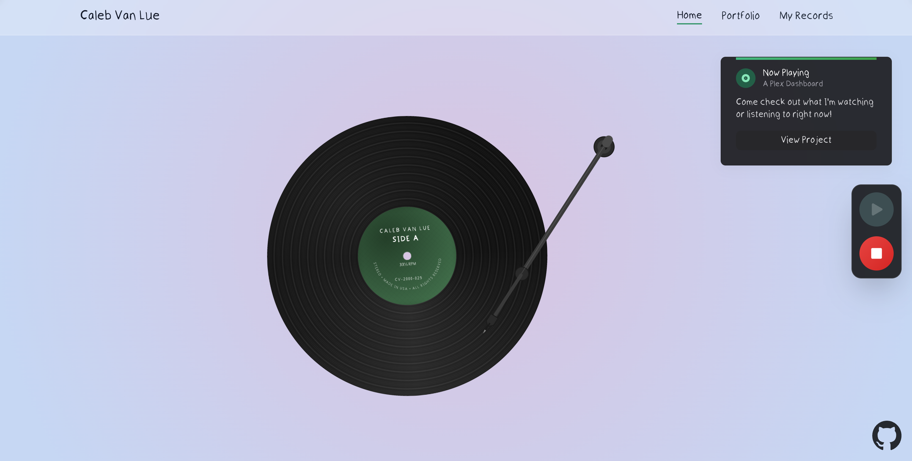

# Side A

My portfolio site, built around a vinyl record player. Drag the tone arm onto the record to start it spinning and surface a project card.



## Pages

- **Home** — interactive record player; needle-on-record triggers the project card
- **Portfolio** — work experience, projects, and skills
- **Collection** — vinyl collection pulled from the Discogs API

## Stack

- Next.js / TypeScript
- Tailwind CSS
- Framer Motion
- Granim.js (gradient background)
- Discogs API

## Running locally

```bash
npm install
npm run dev
```

Requires a `.env.local` with Discogs credentials:

```
DISCOGS_API_BASE_URL=
DISCOGS_USERNAME=
DISCOGS_API_KEY=
```
